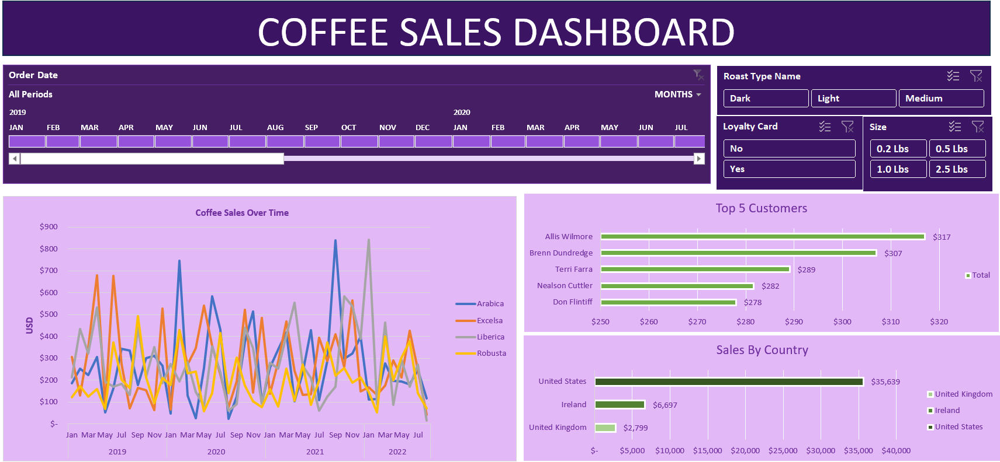

# Coffee Sales Dashboard (Excel Analytics Project)

## Objective

Develop an interactive dashboard to analyze coffee sales performance and uncover insights related to revenue trends, customer behavior, and product performance.

## Tools Used

* Microsoft Excel (PivotTables, PivotCharts, XLOOKUP, INDEX-MATCH)
* Data Cleaning & Transformation

## Dataset

Sales dataset containing information on coffee types, roast categories, customer segments, sales amounts, and geographic distribution.

## Key Features

* Interactive filters (time, roast type, size, loyalty status)
* Revenue trends over time
* Top 5 customers by sales
* Country-wise sales distribution
* Product segmentation by coffee type

## Dashboard Preview

## Key Insights

* A small group of customers contributes disproportionately to total revenue
* Sales fluctuate over time, indicating potential seasonal trends
* Certain coffee types consistently outperform others in revenue generation
* The United States dominates total sales compared to other regions

## Business Value

This dashboard enables stakeholders to:

* Identify high-value customers and target retention strategies
* Understand product performance and optimize inventory decisions
* Analyze geographic sales distribution for market expansion
* Monitor sales trends for better forecasting and planning

## Files

* Coffee Sales Dashboard.xlsx
* README.md
